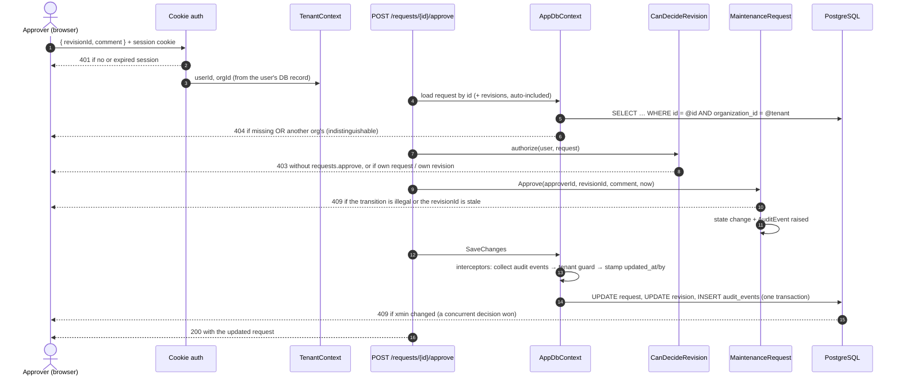
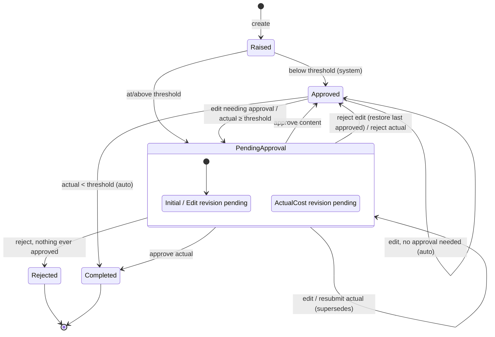
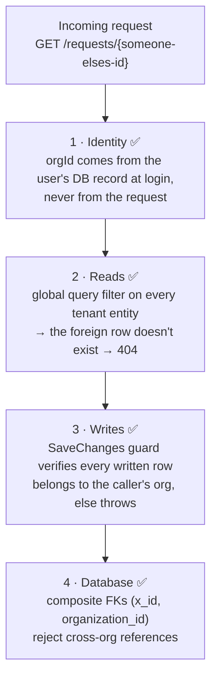
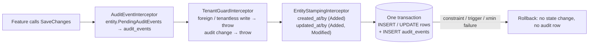

# Architecture

How the system is structured, how a request flows through it, and **where each guarantee is enforced**. The schema is in [SCHEMA.md](SCHEMA.md); the rationale is in [DECISIONS.md](DECISIONS.md).

Status legend: ✅ built · 🔜 planned (step number from [PLAN.md](PLAN.md) §11)

---

## 1. System overview

```mermaid
flowchart LR
    subgraph Client["Browser (static HTML + vanilla JS) 🔜 step 8"]
        UI[Login · Requests · Approve/Reject · Admin panel]
    end

    subgraph Api["ASP.NET Core .NET 10 (single process)"]
        direction TB
        MW["Middleware<br/>cookie auth · rate limit · ProblemDetails"]
        TC["TenantContext<br/>(request-scoped: userId, orgId)"]
        EP["Feature endpoints<br/>Auth · Requests · Admin · Reports"]
        AZ["Authorization<br/>permission policies + resource handlers"]
        DOM["Domain<br/>MaintenanceRequest aggregate<br/>ApprovalRules · RequestTransitions"]
        DB["AppDbContext<br/>query filters · SaveChanges guard<br/>audit + stamping interceptors"]
        MW --> TC --> EP --> AZ --> DOM --> DB
    end

    PG[("PostgreSQL 16<br/>composite FKs · CHECKs<br/>audit trigger")]

    UI -- "JSON over HTTPS<br/>HttpOnly session cookie" --> MW
    DB --> PG
```



**One process, one entry point.** The browser client is a pure API consumer served from `wwwroot/`. There's no server-rendered second path, so every rule is enforced in exactly one place.

---

## 2. Project structure

```
src/Assessment.Api/
├── Program.cs                        ✅ composition root (DI, DbContext, interceptors, pipeline)
├── Domain/                           ✅ no ASP.NET or EF dependencies
│   ├── MaintenanceRequest.cs            aggregate: raise, edit, submit actual, approve, reject
│   ├── RequestRevision.cs               immutable snapshot of each change + its outcome
│   ├── RequestTransitions.cs            the legal-action table (reviewed by hand)
│   ├── ApprovalRules.cs                 when a change needs a human approver
│   ├── Organization.cs · Site.cs · Role.cs · User.cs · Permissions.cs
│   ├── AuditEvent.cs                    append-only record + action names
│   ├── Entity.cs                        timestamps, user stamps, pending audit events
│   └── Guard.cs · DomainExceptions.cs   input invariants; 400 / 409 exception types
├── Infrastructure/
│   ├── Data/                         ✅
│   │   ├── AppDbContext.cs              DbSets; restrict-delete everywhere
│   │   ├── Configurations/              one IEntityTypeConfiguration per aggregate
│   │   ├── AuditEventInterceptor.cs     entity audit events → audit_events, same SaveChanges
│   │   ├── EntityStampingInterceptor.cs created/updated at + by
│   │   └── Migrations/                  InitialSchema (+ raw-SQL audit trigger)
│   └── Tenancy/
│       ├── TenantContext.cs          ✅ who is calling, for which org
│       └── TenantGuardInterceptor.cs ✅ write guard (reads: query filters in AppDbContext)
├── Authorization/                    🔜 step 4   permission policies, CanDecideRevision, CanModifyRequest
├── Features/                         🔜 steps 4–7
│   ├── Auth/        login · logout · me
│   ├── Requests/    create · list · get · edit · complete · approve · reject · history
│   ├── Admin/       users · roles · threshold
│   └── Reports/     spend by site
└── wwwroot/                          🔜 step 8   static client

tests/Assessment.Api.Tests/
├── Domain/          ✅ transition table (every state × action), approval rules, revisions, audit, roles
├── Persistence/     ✅ DB guarantees, cross-tenant reads/writes by real id, fail-closed, model conventions
└── (Http/)          🔜 authz, cross-tenant, report numbers
```

**Dependency rule:** `Domain` depends on nothing. `Infrastructure` depends on `Domain`. `Features` and `Authorization` depend on both. It's enforced by convention and review, not separate assemblies (see DECISIONS.md).

---

## 3. Responsibilities: who enforces what

| Concern | Enforced in | Mechanism | Failure |
|---|---|---|---|
| **Who is calling** | Cookie auth → `TenantContext` | The org and user come from the user's DB record at login. They're never read from a route, query string or body. | 401 |
| **Which data exists for you** | `AppDbContext` global query filters ✅ | `WHERE organization_id = @tenant` on every tenant entity | 404 |
| **No writes to another tenant** | `TenantGuardInterceptor` ✅ + composite FKs ✅ | Verifies every added, modified or deleted row belongs to the caller's org. Refuses writes with no tenant. Refuses audit changes. The DB rejects cross-org references. | 500 (a bug, never user error) |
| **What you may do** | Permission policies 🔜 | `requests.create`, `requests.approve`, `admin.*`, … (never role names) | 403 |
| **Conflict of interest** | `CanDecideRevision` handler 🔜 + DB CHECK ✅ | No deciding your own request or a revision you submitted (OrgAdmin included) | 403 |
| **What is legal now** | `RequestTransitions` ✅ | `(status, pending kind) → allowed actions` | 409 |
| **Needs a human?** | `ApprovalRules` ✅ | The amount vs the **request's snapshotted** threshold | routes to PendingApproval |
| **Approve what you saw** | `MaintenanceRequest` ✅ | `revisionId` must be the current pending one | 409 |
| **Concurrent decisions** | `xmin` concurrency token ✅ | The second writer loses | 409 |
| **Input shape** | Endpoint validation 🔜 + `Guard` ✅ | Lengths, amounts > 0, ≤ 10M, 2 dp, required reasons | 400 |
| **Audit written** | `AuditEventInterceptor` ✅ | Domain-raised events are saved in the **same transaction** | the whole save rolls back |
| **Audit immutable** | DB trigger ✅ | UPDATE, DELETE and TRUNCATE are rejected | DB error |
| **Who / when on every row** | `EntityStampingInterceptor` ✅ | `created_*` write-once, `updated_*` on every change | — |

---

## 4. Request flow: approving a revision

The path every mutating call follows, with the layer where each kind of failure is raised:



---

## 5. Request lifecycle

The authoritative table is `Domain/RequestTransitions.cs`, and it's tested exhaustively.



**Approval rules** (the threshold is the request's snapshot from creation):
- content: `amount ≥ threshold AND (nothing approved yet OR amount > approved amount OR description changed)`
- actual cost: `actual ≥ threshold`

---

## 6. Tenant isolation, layer by layer



**Why the data layer:** a check written per endpoint gets forgotten eventually, while a query filter is on by default. The single allowed bypass, `IgnoreQueryFilters()`, is login's email lookup. A test enforces that it's the only one (step 3).

---

## 7. Persistence pipeline (one `SaveChanges`)



The interceptor order is set in `Program.cs`: audit collection first (so the guard checks audit rows too), then the tenant guard, then stamping.

**Tenant states** (`TenantContext`):
- **unset:** reads return nothing (the filters compare against null) and writes are refused. It fails closed.
- **tenant:** everything is confined to one org.
- **system:** cross-org writes are allowed. Only seeding and test setup use it, and it's never reachable from HTTP.

---

## 8. Cross-cutting choices

| Area | Choice |
|---|---|
| Time | `TimeProvider` injected everywhere, so tests control the clock. All timestamps are `timestamptz` UTC. |
| IDs | `Guid.CreateVersion7()`: time-ordered, and not enumerable. Isolation doesn't depend on IDs being unguessable. |
| Errors | `ProblemDetails`. Domain exceptions map to 400 (invalid) and 409 (illegal transition, stale revision, concurrency). |
| Config & secrets | `appsettings.Development.json` holds only a throwaway local DB password. Overrides go in user-secrets or env vars; production uses a secret manager. |
| Migrations | EF Core. Applied on startup **only** when `Database:MigrateOnStartup` is set (Development). |
