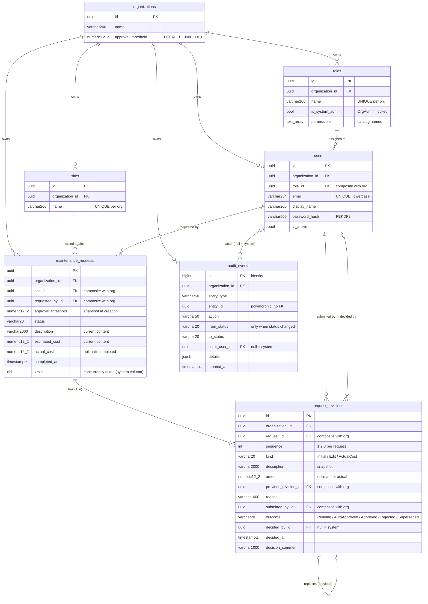

# Database Schema

PostgreSQL 16, generated by the EF Core migrations in `Infrastructure/Data/Migrations/`: `InitialSchema` (plus a raw-SQL trigger) and `RequestListIndexes`. All identifiers are snake_case. This document mirrors that migration; **if they ever disagree, the migration is the truth.**

To regenerate the full DDL: `dotnet ef migrations script --project src/Assessment.Api`

---

## 1. Entity-relationship diagram



**Omitted from the diagram for readability.** Every table except `audit_events` also has:

| Column | Type | Set by |
|---|---|---|
| `created_at` | `timestamptz NOT NULL` | interceptor, once |
| `updated_at` | `timestamptz NOT NULL` | interceptor, on every change |
| `created_by_id` | `uuid NULL` | interceptor, once (NULL = system/seed) |
| `updated_by_id` | `uuid NULL` | interceptor, on every change |

---

## 2. Tenant isolation in the schema

Every tenant-owned table carries `organization_id`. Each parent also exposes a **unique `(id, organization_id)` key**. Children reference that pair, not `id` alone:

```
maintenance_requests (site_id, organization_id)  →  sites (id, organization_id)
```

A row can therefore only reference a parent **in the same organization**. Even if application code let a foreign ID through, the insert fails with `23503 foreign_key_violation`. A test proves this (`SchemaGuaranteesTests.Request_against_another_organizations_site_is_rejected…`).

| Child → parent | Composite FK |
|---|---|
| users → roles | `(role_id, organization_id)` |
| maintenance_requests → sites | `(site_id, organization_id)` |
| maintenance_requests → users | `(requested_by_id, organization_id)` |
| request_revisions → maintenance_requests | `(request_id, organization_id)` |
| request_revisions → users (submitter) | `(submitted_by_id, organization_id)` |
| request_revisions → users (decider) | `(decided_by_id, organization_id)` |
| request_revisions → request_revisions | `(previous_revision_id, organization_id)` |
| audit_events → users (actor) | `(actor_user_id, organization_id)` |

All FKs are `ON DELETE RESTRICT`. Nothing cascades, so history can't disappear as a side effect. Users are deactivated, never deleted.

---

## 3. Constraints

| Table | Constraint | Rule | Why |
|---|---|---|---|
| organizations | `ck_organizations_threshold` | `approval_threshold >= 0` | |
| users | `ck_users_email_lowercase` | `email = lower(email)` | Makes the plain unique index case-insensitive in effect |
| users | `ix_users_email` (unique) | global | Login by email without an org code |
| sites, roles | unique `(organization_id, name)` | per org | |
| maintenance_requests | `ck_requests_estimated_cost` | `estimated_cost > 0` | |
| maintenance_requests | `ck_requests_actual_cost` | `actual_cost IS NULL OR actual_cost > 0` | |
| maintenance_requests | `ck_requests_threshold` | `approval_threshold >= 0` | |
| maintenance_requests | `ck_requests_status` | in the 5 known statuses | Enums are stored as text for readable SQL and audit |
| maintenance_requests | `ck_requests_completed_has_actual` | `status <> 'Completed' OR (actual_cost AND completed_at NOT NULL)` | A completed job always has a cost |
| request_revisions | `ck_revisions_amount` | `amount > 0` | |
| request_revisions | `ck_revisions_kind`, `ck_revisions_outcome` | known values | |
| request_revisions | `ck_revisions_not_self_decided` | `decided_by_id IS NULL OR decided_by_id <> submitted_by_id` | **Backstop** for the no-self-approval permission rule |
| request_revisions | `ux_request_revisions_one_pending` | unique `(request_id) WHERE outcome = 'Pending'` | At most one revision awaiting a decision |
| request_revisions | unique `(request_id, sequence)` | | Deterministic revision order |

---

## 4. Audit table immutability

Created by raw SQL in the migration:

```sql
CREATE FUNCTION audit_events_block_changes() RETURNS trigger LANGUAGE plpgsql AS $$
BEGIN
    RAISE EXCEPTION 'audit_events is append-only: % is not allowed', TG_OP
        USING ERRCODE = 'insufficient_privilege';
END; $$;

CREATE TRIGGER audit_events_no_update_delete BEFORE UPDATE OR DELETE ON audit_events
    FOR EACH ROW EXECUTE FUNCTION audit_events_block_changes();
CREATE TRIGGER audit_events_no_truncate BEFORE TRUNCATE ON audit_events
    FOR EACH STATEMENT EXECUTE FUNCTION audit_events_block_changes();
```

- **This blocks the application's own DB user**, not just application code. It's tested with raw SQL for all three operations.
- **What it doesn't stop:** a superuser or the table owner can disable the trigger.
- **Production:** the app connects as a role with only `INSERT, SELECT` on `audit_events`, a separate role owns the table, and events are shipped to WORM storage (DECISIONS.md).

---

## 5. Indexes: each one serves a known query

| Index | Columns | Serves |
|---|---|---|
| `ix_maintenance_requests_list` | `(organization_id, created_at DESC, id DESC)` | Default request list (all statuses), paged `ORDER BY created_at DESC, id DESC`. The index order equals the sort order, so a page is read straight off the index: **verified** with `EXPLAIN` on EF's SQL, no Sort step |
| `ix_maintenance_requests_list_by_status` | `(organization_id, status, created_at DESC, id DESC)` | Status-filtered list (e.g. the approval queue), same guarantee: **verified**, no Sort step |
| `ix_maintenance_requests_spend_report` | `(organization_id, site_id, completed_at) INCLUDE (actual_cost) WHERE status = 'Completed'` | Spend report: partial (only completed rows) and covering (no heap lookup for the amount). **Verified** with `EXPLAIN` on the SQL EF actually generates: Index Only Scan. |
| `ix_request_revisions_request_id_sequence` (unique) | `(request_id, sequence)` | Loading a request's revisions in order |
| `ux_request_revisions_one_pending` (unique, partial) | `(request_id) WHERE outcome = 'Pending'` | The invariant, plus the pending lookup |
| `ix_audit_events_organization_id_entity_id_created_at` | `(organization_id, entity_id, created_at)` | A request's history timeline |
| `ix_users_email` (unique) | `(email)` | Login |
| `ix_sites_…_name`, `ix_roles_…_name` (unique) | `(organization_id, name)` | Uniqueness, plus the org's site and role lists |

EF also creates an index for each FK, e.g. `(site_id, organization_id)`. Nothing is ever deleted here, so those mainly help the join paths. They're kept rather than hand-pruned, as a deliberate simplicity trade-off.

---

## 6. What's derived rather than stored

| Value | Derived from | Why not a column |
|---|---|---|
| Pending revision | `request_revisions WHERE outcome = 'Pending'` (at most one, guaranteed by index) | Avoids a circular FK between requests and revisions |
| Last approved content | The latest `Initial`/`Edit` revision with outcome `Approved` or `AutoApproved` | Same reason; one source of truth |
| Who approved / when | `request_revisions.decided_by_id`, `decided_at` + `audit_events` | The history is the record |
| Spend per site | `SUM(actual_cost)` over completed requests, per site | Aggregates are computed at query time; there's no denormalised total to drift |

---

## 7. Example: the rows for one request

A 15,000 request (threshold 10,000) that's approved, then edited to 16,000 and approved again:

**request_revisions**

| sequence | kind | amount | outcome | submitted_by | decided_by |
|---|---|---|---|---|---|
| 1 | Initial | 15000 | Approved | Rita | Andy |
| 2 | Edit | 16000 | Approved | Rita | Andy |

**audit_events**

| action | from → to | actor | details |
|---|---|---|---|
| Raised | – → Raised | Rita | site, description, 15000, threshold 10000 |
| SubmittedForApproval | Raised → PendingApproval | Rita | revision 1 |
| Approved | PendingApproval → Approved | Andy | revision 1, comment |
| Edited | – | Rita | 15000 → 16000, reason |
| SubmittedForApproval | Approved → PendingApproval | Rita | revision 2 |
| Approved | PendingApproval → Approved | Andy | revision 2 |
